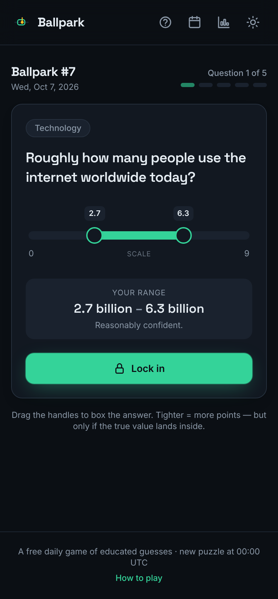
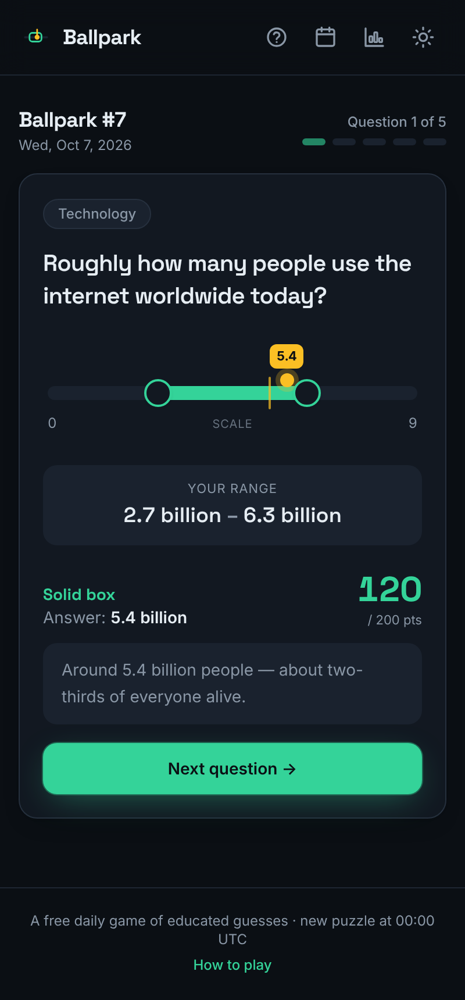
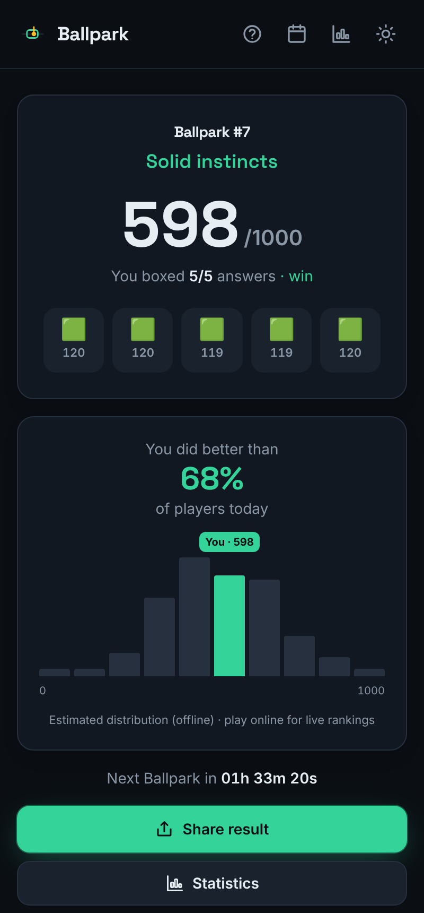
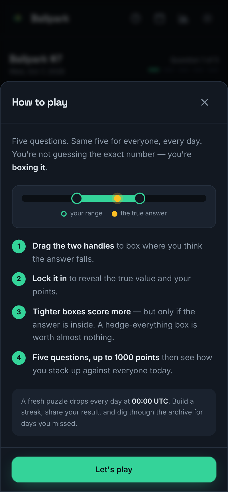
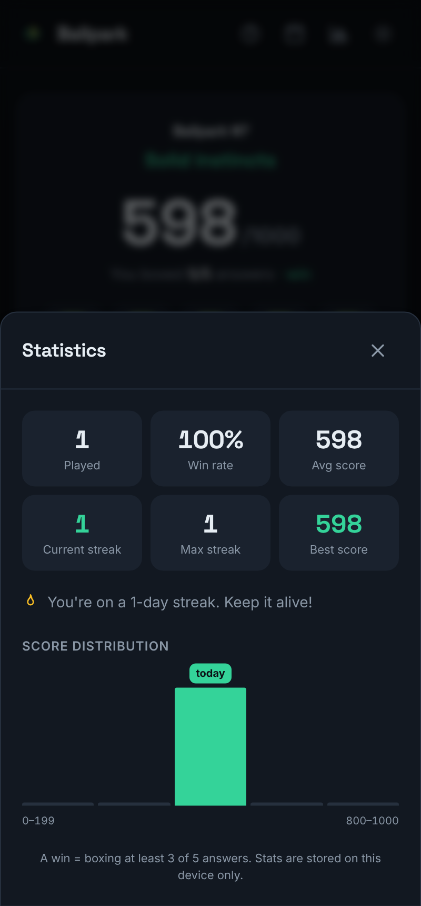
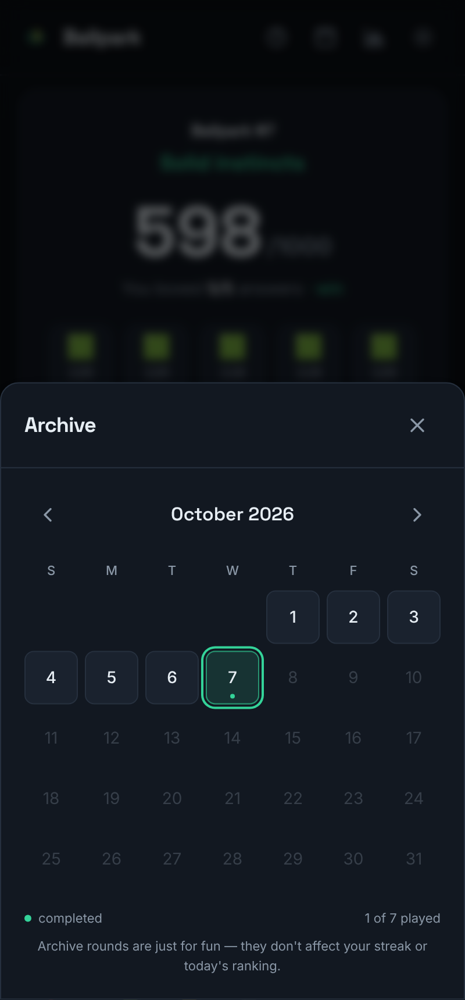

<div align="center">


# Ballpark

**A daily game of educated guesses. Don't name the number — box it.**

Every day, five questions. You don't type an answer — you draw a **confidence range**
and try to box the truth. The tighter your box, the more you score… but only if you're
right. It's part trivia, part knowing *how much you actually know*.

[](https://github.com/viktor-lorentz/ballpark/actions/workflows/ci.yml)
[](LICENSE)


<br />





</div>

---

## Why it's fun

Most trivia games reward *knowing the exact answer*. Ballpark rewards **calibration** —
being honest about your uncertainty. If you're sure a volcano is roughly 2,000 m tall,
box it tight and bank big points. If you have no idea, you can play it safe with a wide
box, but you'll score next to nothing. There's no hiding behind a hedge.

That little tension — *how confident am I, really?* — makes a 2-minute round surprisingly
moreish, and it spreads scores out nicely so the daily percentile actually means something.

## Features

- 🎯 **One puzzle a day, the same for everyone** — a fresh set of five questions drops at
  **00:00 UTC**, with a live countdown to the next one.
- 📊 **Real daily rankings** — submit your score anonymously and see *"you did better than
  X% of players today"* on a live histogram, powered by a tiny Cloudflare Worker + D1
  backend. No backend running? The game falls back to a built-in estimate and keeps working.
- 📈 **Local statistics** — games played, win rate, current & max streak, average score and
  a personal score distribution, all stored on-device.
- 🗓️ **Archive** — a calendar of every past puzzle, with completed days marked. Archive
  rounds are just for fun; they don't touch your streak or today's ranking.
- 🔗 **Spoiler-free sharing** — one tap copies a Wordle-style emoji result you can post
  anywhere, with no answers given away.
- 🌗 **Dark & light themes**, smooth micro-animations, and a **mobile-first** layout.
- 🆓 **Completely free** — no accounts, no ads, no tracking.

## How scoring works

Each question has a true value and a slider domain (log or linear, whichever suits the
quantity). You set a `[low, high]` bracket. For each question:

- If the true value is **outside** your bracket → **0 points**.
- If it's **inside** → points scale with how *tight* the bracket is, measured in the
  domain's own scale:

  ```
  coverage = (bracket width) / (domain width)        # 0 = pinpoint, 1 = whole scale
  points   = round(200 × (1 − coverage))             # per question, 0–200
  ```

Five questions, so a round is **0–1000**. A "win" is boxing at least 3 of 5. The maths
lives in [`src/lib/scoring.ts`](src/lib/scoring.ts) and is covered by unit tests.

## Tech stack

| Area | Choice |
| --- | --- |
| Framework | React 18 + TypeScript |
| Build | Vite 5 |
| Styling | Tailwind CSS (CSS-variable theming for dark/light) |
| Animation | Framer Motion |
| Tests | Vitest |
| Backend | Cloudflare Worker + D1 (SQLite) |
| Hosting | Static site on Cloudflare Pages / Vercel / Netlify |

## Project structure

```
ballpark/
├── src/
│   ├── lib/            # pure logic: scoring, daily schedule, stats, ranking, sharing
│   ├── components/     # UI: slider, play & results screens, modals, charts
│   ├── hooks/          # useGame (state machine), useTheme, useCountdown
│   ├── data/           # facts.json (the fact pool) + puzzles.json (generated schedule)
│   └── test/           # Vitest unit tests
├── scripts/
│   └── generate-puzzles.mjs   # deterministic daily-puzzle generator
├── worker/             # Cloudflare Worker + D1 scores API
└── docs/screenshots/   # images used in this README
```

## Getting started

Requirements: **Node 20+**.

```bash
npm install
npm run dev          # http://localhost:5173
```

Other scripts:

```bash
npm run test         # unit tests (Vitest)
npm run typecheck    # tsc, no emit
npm run lint         # eslint
npm run build        # production build to dist/
npm run preview      # serve the production build locally
```

The game is fully playable out of the box with **no backend** — rankings use a built-in
offline estimate until you wire up the Worker below.

## The daily content system

Puzzles are generated **deterministically** so everyone gets the same thing on the same day.

- [`src/data/facts.json`](src/data/facts.json) is the **fact pool** — the single source of
  truth. Each fact has a prompt, true value, unit, slider domain, scale and a fun blurb.
- [`scripts/generate-puzzles.mjs`](scripts/generate-puzzles.mjs) assembles the schedule into
  `src/data/puzzles.json`, picking five varied facts per day and avoiding repeats.

### Adding more puzzles

1. Add new entries to `src/data/facts.json` (keep the same shape).
2. Extend the schedule:

   ```bash
   npm run generate        # appends new days; never changes already-published days
   ```

   The generator is **incremental** — it reads the existing schedule and only adds future
   days, so a date that has already gone live always stays the same for everyone. To rebuild
   the whole thing from scratch, run `npm run generate:fresh`.

Ships with **120 days** of puzzles up front, starting from the launch epoch in
`puzzles.json`.

## Backend: anonymous daily rankings

The `worker/` folder is a self-contained Cloudflare Worker backed by a D1 database. It
accepts anonymous score submissions and returns today's score histogram.

- **Dedupe:** one row per `(day, client)` via the primary key — resubmissions are no-ops.
- **Spam protection:** per-IP daily cap and strict range validation on every field.
- **Privacy:** the client id and IP are only ever stored as salted SHA-256 hashes.

### Deploy it (free tier)

```bash
cd worker
npm install
npx wrangler login

# 1. Create the database and paste the printed database_id into wrangler.toml
npx wrangler d1 create ballpark

# 2. Create the table
npm run db:init

# 3. Set a secret salt for the hashes
npx wrangler secret put SALT        # paste any long random string

# 4. Ship it
npm run deploy
```

Wrangler prints your Worker URL (e.g. `https://ballpark-api.<you>.workers.dev`). Point the
frontend at it by creating a `.env` in the project root:

```bash
VITE_API_URL=https://ballpark-api.<you>.workers.dev
```

Rebuild, and the results screen now shows **live** rankings. If `VITE_API_URL` is unset or
the Worker is unreachable, the app automatically falls back to the offline estimate.

## Deploy the site

It's a static site — any of these work on the free tier:

**Cloudflare Pages** (pairs naturally with the Worker)
- Build command: `npm run build`
- Output directory: `dist`
- Add the `VITE_API_URL` environment variable in the Pages project settings.

**Vercel / Netlify**
- Framework preset: **Vite**
- Build command: `npm run build`, output: `dist`
- Add `VITE_API_URL` as an environment variable.

## Screenshots

<div align="center">




</div>

## License

[MIT](LICENSE) © Viktor Lorentz
